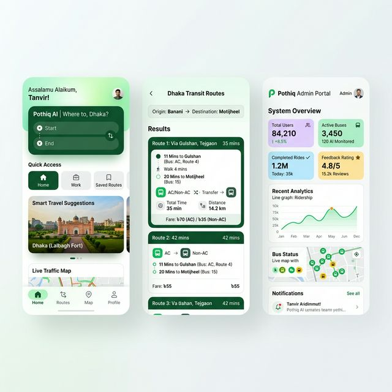

# Pothiq AI: Smart Dhaka Transit App 🚌

Pothiq AI (পথিক এআই) is a premium, offline-first transit assistant designed specifically for the complex bus routes of the Dhaka Metropolitan Area. Using a combination of local SQLite storage and fuzzy search algorithms, it provides users with real-time route details, fare calculations, and bus operator information without requiring an internet connection.



---

## 🚀 Key Features

*   **Smart Bus Search:** Dual-autocomplete interface to find routes between any two stops with support for fuzzy matching (searching "Mirpur" finds "Mirpur-1", "Mirpur-10", etc.).
*   **Intermediate Stop Detection:** The search algorithm correctly identifies routes that pass through your origin and destination even if they aren't the primary terminal stops.
*   **Dynamic Fare Calculator:**
    *   **Fixed Fare:** Displays the standard route fare.
    *   **Distance-based:** Calculations based on 2.45 BDT/KM (Minimum 10 BDT), rounded for convenience.
*   **Visual Timelines:** View the complete sequence of stops for any route with clear indicators for the start, intermediate, and end points.
*   **Offline-First:** All data, including the database of 200+ route segments and 45+ stops, is stored locally for maximum performance and availability in transit.
*   **Bilingual Support:** Switch instantly between English and Bengali (বাংলা) logic.

---

## 🛠️ Technology Stack

*   **Frontend Framework:** [Expo](https://expo.dev/) (SDK 55) + [React Native](https://reactnative.dev/)
*   **Main Language:** TypeScript
*   **Database:** `expo-sqlite` (Relational storage for stops, buses, and routes)
*   **Global State Management:** [Zustand](https://github.com/pmndrs/zustand)
*   **UI System:** [React Native Paper](https://reactnativepaper.com/) (Material Design 3)
*   **Utilities:**
    *   `fuse.js` (Fuzzy Search for stop autocomplete)
    *   `bcryptjs` (Secure admin PIN hashing)
    *   `papaparse` (High-performance CSV parsing)
    *   `expo-secure-store` (Encrypted local storage for admin credentials)

---

## 🛤️ Onboarding Process

### 1. First Launch & Database Setup
Upon first opening the app, Pothiq AI initializes a local SQLite database and seeds it with high-quality transit data for 45 major stops and 32 initial bus routes.

### 2. Basic Search Onboarding
*   **Origin Selection:** Start typing your starting stop in the first search bar. The fuzzy search will suggest matches immediately.
*   **Destination Selection:** Enter your final destination.
*   **Route Review:** Browse the returned search results, showing bus names (Doleshwar, Bihongo, etc.), their types (AC/Non-AC), and the travel distance.

### 3. Exploring the Transit Network
*   Navigate to the **Routes** tab to explore the entire Dhaka transit network by specific buses or stops.

### 4. Admin Access (For Transit Data Management)
*   Go to the **Settings** tab and tap **Admin Login**.
*   Standard onboarding PIN: **`123456`**.
*   Admins can perform CRUD operations, Import CSV data, and perform JSON system backups.

---

## 💻 Running Locally

### Prerequisites
*   Node.js (LTS version)
*   Expo Go app on your physical device or an emulator (Android/iOS)

### Installation
1.  Navigate to the project root:
    ```bash
    cd pothiq-ai
    ```
2.  Install dependencies:
    ```bash
    npm install
    ```
3.  Start the development server:
    ```bash
    npx expo start
    ```
4.  Scan the QR code with your phone or press `a` (Android) or `i` (iOS) for emulators.

---

## 🔒 Security
The Admin Panel is protected by 5-attempt brute-force protection and a 5-minute auto-logout timer on inactivity. PINs are salted and hashed using bcrypt.

---

## 📄 License
This project is for educational purposes only. Dhaka transit data is provided as-is based on current metropolitan bus route information.
