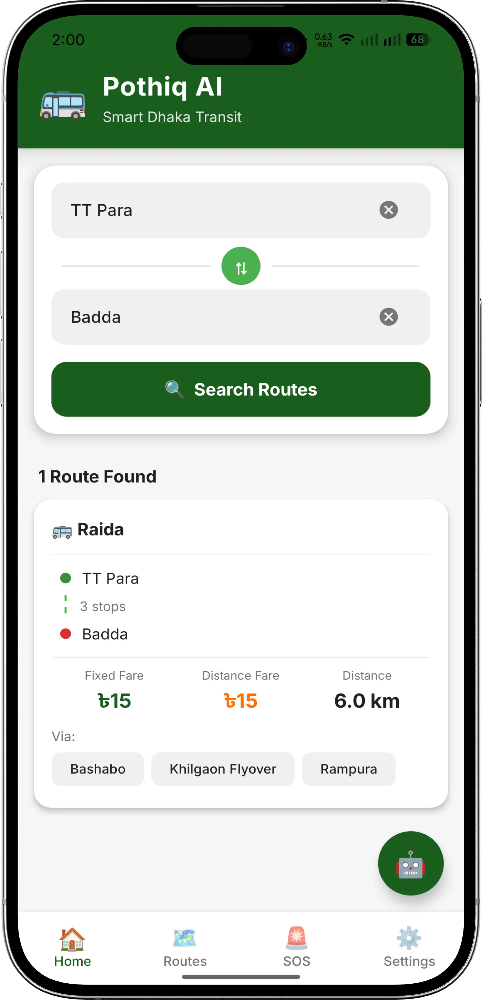
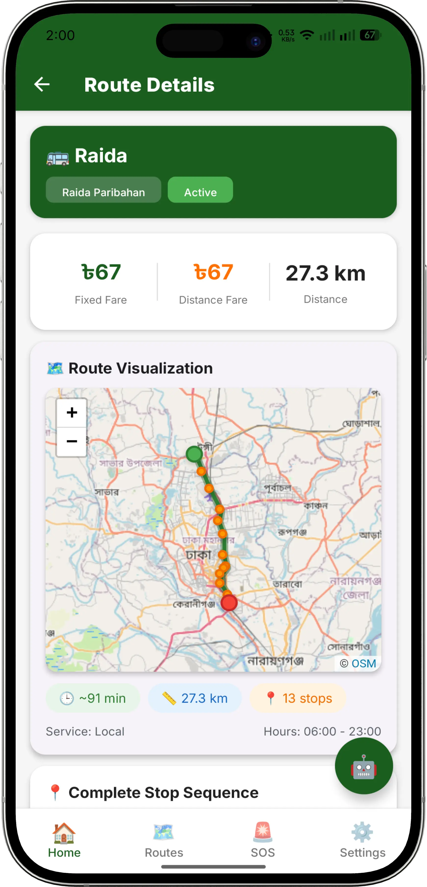
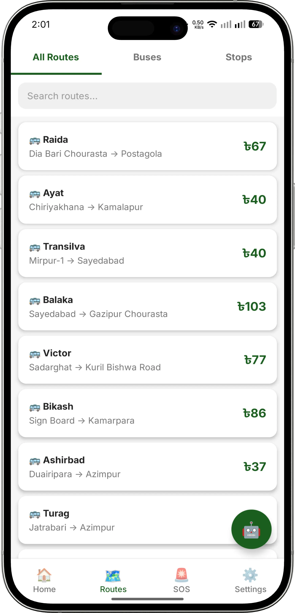
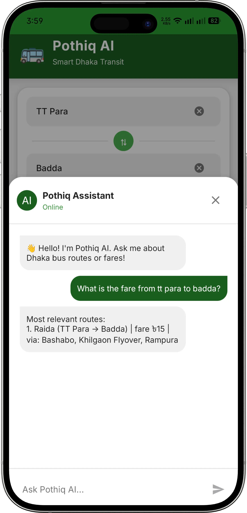
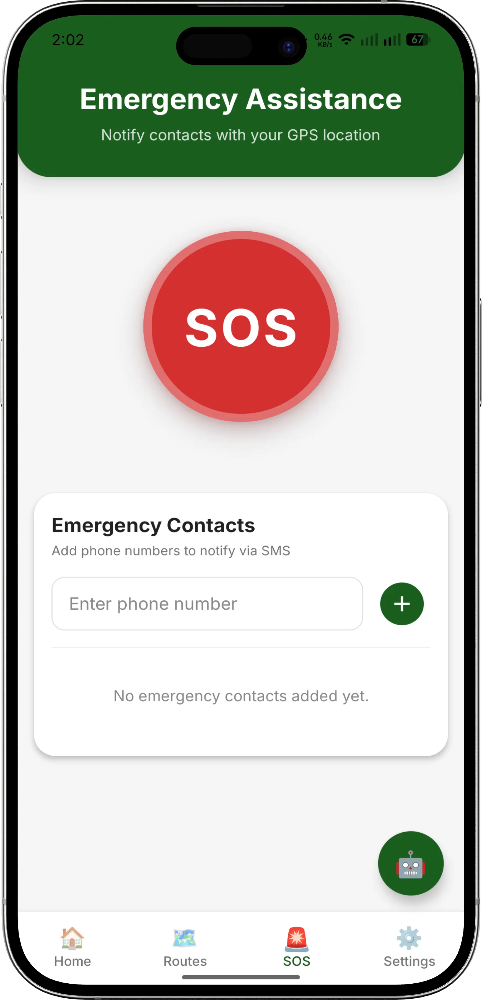
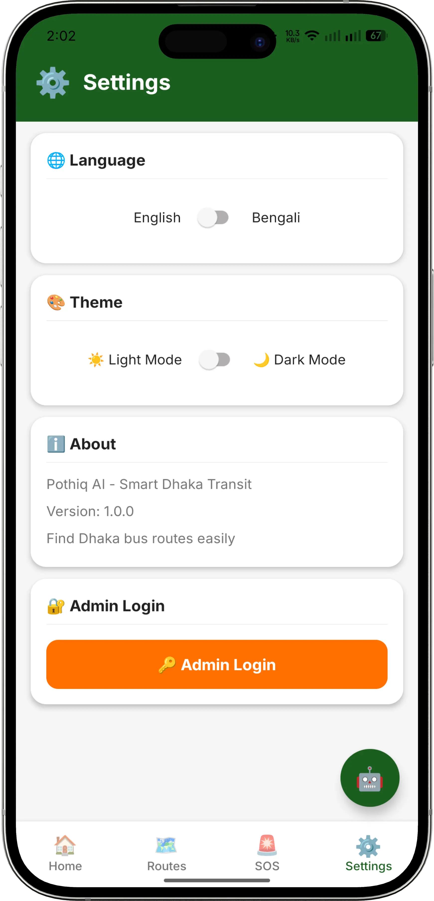
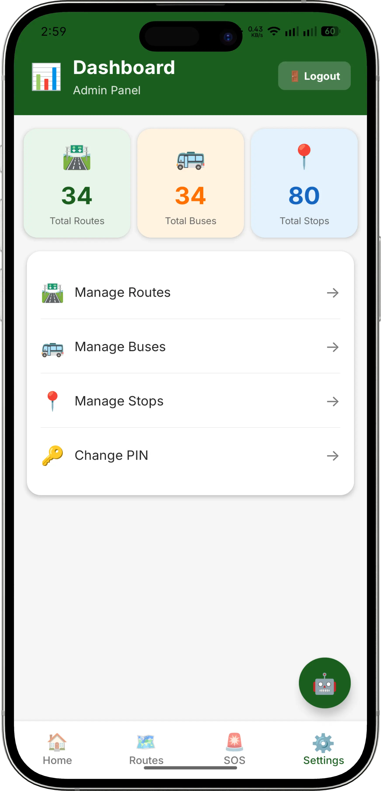

# Pothiq AI: Smart Dhaka Transit App 🚌

[](https://expo.dev/)
[](https://reactnative.dev/)
[](https://www.typescriptlang.org/)
[](https://docs.expo.dev/versions/latest/sdk/sqlite/)
[](LICENSE)

**Pothiq AI (পথিক এআই)** is a modern, offline-first transit companion tailored for Dhaka's complex bus network. Combining local SQLite storage, fuzzy search algorithms, interactive map routing, and an on-device AI assistant, Pothiq AI delivers accurate route suggestions, fair fare calculations, and operator insights—entirely offline.

---

## 📱 App Highlights & Visual Tour

<div align="center">

### Core Transit Experience

| Smart Route Search | Live Route Visualization & Map | Transit Network Explorer |
| :---: | :---: | :---: |
|  |  |  |
| Dual autocomplete search with fuzzy matching & dynamic fare comparisons | Turn-by-turn stop sequence, OSM map visualization & travel time estimates | Searchable directory of all Dhaka bus operators, lines, and terminal stops |

<br/>

### Intelligence, Safety & Administration

| Pothiq AI Assistant | Emergency SOS & Safety | Settings & Localization | Admin Control Center |
| :---: | :---: | :---: | :---: |
|  |  |  |  |
| Conversational route & fare inquiries right from the bottom sheet | One-tap emergency broadcast with real-time GPS coordinates via SMS | Seamless English/বাংলা language toggle & Light/Dark theme switching | Real-time transit database metrics and full CRUD management |

</div>

---

## 🚀 Key Features

*   🔍 **Smart Bus Search:** Dual-autocomplete interface to find routes between any two stops with fuzzy tolerance (e.g., typing *"Mirpur"* surfaces *"Mirpur-1"*, *"Mirpur-10"*, etc.).
*   📍 **Intermediate Stop Detection:** Accurately recognizes routes traversing intermediate pickup points, even if they aren't designated terminal stops.
*   🗺️ **Interactive Route Mapping:** Visualizes complete route paths on OpenStreetMap tiles with pinpoints for all stops, estimated transit duration, and operating hours.
*   💰 **Dynamic Fare Calculator:**
    *   **Fixed Fare:** Official route ticket pricing.
    *   **Distance-Based:** Transparent calculation at 2.45 BDT/KM (Minimum 10 BDT), rounded for convenience.
*   🤖 **Pothiq AI Transit Bot:** In-app assistant providing instant conversational recommendations on routes, stops, and pricing.
*   🚨 **Emergency SOS Beacon:** Instant safety trigger notifying designated emergency contacts with your live GPS location via SMS.
*   🌐 **Bilingual & Themed:** One-tap switching between English and Bengali (বাংলা), alongside full Dark and Light mode support.
*   ⚡ **100% Offline-First:** Fully seeded local SQLite database with 200+ route segments and 80+ metropolitan stops for uninterrupted use during travel.

---

## 🛠️ Technology Stack

*   **Frontend Framework:** [Expo](https://expo.dev/) (SDK 57) + [React Native](https://reactnative.dev/) (0.86)
*   **Main Language:** TypeScript
*   **Local Database:** `expo-sqlite` (High-performance relational storage for stops, routes, and buses)
*   **State Management:** [Zustand](https://github.com/pmndrs/zustand)
*   **Design System:** [React Native Paper](https://reactnativepaper.com/) (Material Design 3)
*   **Maps & Navigation:** OpenStreetMap (OSM) tile rendering with route coordinates
*   **Utilities:**
    *   `fuse.js` — High-speed fuzzy search for stop and route lookup
    *   `bcryptjs` — Salted admin PIN encryption
    *   `papaparse` — Rapid CSV transit data parsing
    *   `expo-secure-store` & `expo-location` — Encrypted credential storage and device GPS integration

---

## 🛤️ User Workflow & Onboarding

### 1. First Launch & Local Database Initialization
Upon initial launch, Pothiq AI establishes a local SQLite database and pre-seeds it with Dhaka transit routes, verified stop coordinates, and bus schedules.

### 2. Searching for a Route
1. **Select Origin:** Begin typing in the first field; fuzzy search suggests closest matches instantly.
2. **Select Destination:** Type your destination or swap stops with the toggle button.
3. **Review Route Options:** Examine available buses (e.g., Raida, Transilva, Bihongo), compare fixed vs. distance fares, and review intermediate stops.
4. **Inspect Route Map:** Tap any route to open the interactive map view, examine stop markers, and monitor travel time estimates.

### 3. Emergency SOS Assistance
Configure emergency contacts in the **SOS** tab. In an urgent situation, pressing the central **SOS button** dispatches an emergency SMS with exact GPS coordinates.

### 4. Admin Management Portal
*   Navigate to **Settings** ➔ **Admin Login**.
*   Default onboarding PIN: **`123456`**.
*   Admins can view real-time fleet analytics, perform CRUD operations on routes, buses, and stops, or import transit CSV data.

---

## 💻 Running Locally

### Prerequisites
*   [Node.js](https://nodejs.org/) (LTS version)
*   [Expo Go](https://expo.dev/go) app on your physical mobile device (Android/iOS) or an active emulator.

### Setup Instructions
1.  **Clone and navigate to the project directory:**
    ```bash
    git clone https://github.com/your-username/pothiq-ai.git
    cd pothiq-ai
    ```
2.  **Install dependencies:**
    ```bash
    npm install
    ```
3.  **Start the development server:**
    ```bash
    npx expo start
    ```
4.  **Launch on Device:**
    *   Scan the QR code with **Expo Go** (Android/iOS).
    *   Press `a` in the terminal to launch the Android emulator.
    *   Press `w` to open in a web browser.

---

## 🔒 Security
*   **Brute-Force Protection:** The Admin Panel locks after 5 consecutive failed attempts.
*   **Auto-Logout:** Admin sessions expire after 5 minutes of inactivity.
*   **Encrypted Storage:** Passwords and PINs are salted and hashed with `bcryptjs`.

---

## 📄 License
This project is for educational and public transit utility purposes. Dhaka transit information is aggregated and maintained from metropolitan public transit records.

